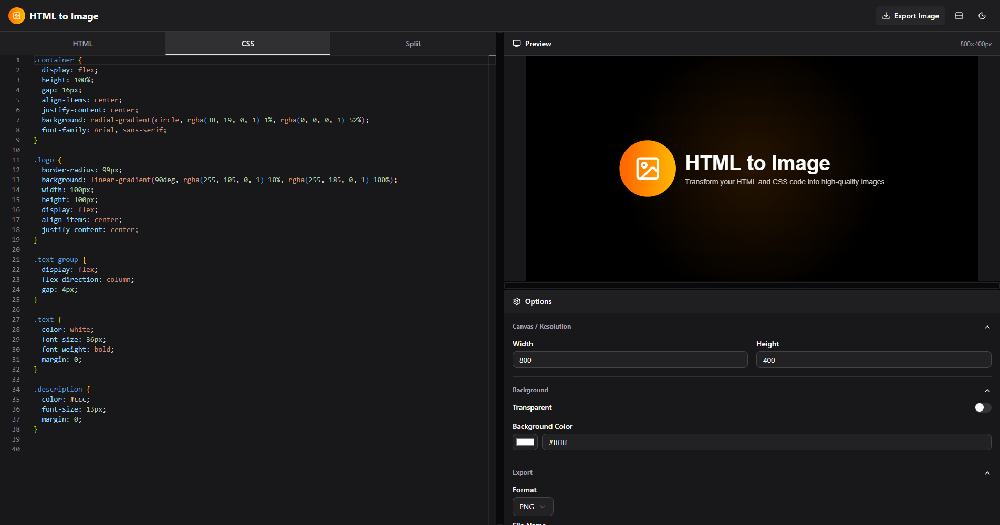

<div align="center">

# HTML to Image

<a href="https://htmltoimage3.vercel.app">

</a>


</div>

## ✨ What is HTML to Image?

**HTML to Image** is a modern web application that converts HTML and CSS code into high-quality images. <cite/> It provides a live editor with instant preview and multiple export options for developers and designers.

The application is built with modern web technologies that ensure performance and user experience:

**Frontend Framework**

- **React** with TypeScript for type-safe component development <cite/>
- **Vite** as the build tool for a fast and lightweight development experience <cite/>

**UI & Design System**

- **TailwindCSS** for utility-first styling
- **Shadcn/ui** on top of Radix primitives for accessible components

## 🎯 Core Features

**Editor Features:**

- ✅ Real-time HTML/CSS code editor
- ✅ Instant live preview
- ✅ Configurable options panel
- ✅ Canvas and resolution configuration

**Export Options:**

- ✅ Multiple formats: PNG, JPEG, SVG
- ✅ Customizable dimensions

**Interface Features:**

- ✅ Collapsible accordion options panel
- ✅ Resizable panels (editor, preview, and options)
- ✅ Flexible panel distribution (rearrange editor, preview, and options layout)

## 🚀 Getting Started

**Requirements:**

- [x] [Node.js](https://nodejs.org) (+v18.x) installed
- [x] [npm](https://nodejs.org/es/) installed
- [x] [Visual Studio Code](https://code.visualstudio.com) with recommended extensions

**Steps:**

1. [Fork](https://github.com/jntellez/html-to-image/fork) this project.

2. Clone the repository:

```bash
git clone https://github.com/@username/html-to-image.git
```

3. Install dependencies:

```bash
npm install
```

4. Run the development server:

```bash
npm run dev
```

Open [http://localhost:5173](http://localhost:5173) with your browser 🚀

## ✌️ Contributing

Contributions are welcome! Please feel free to submit a Pull Request.

## 📝 License

This project is open source and available under the [MIT License](LICENSE).
